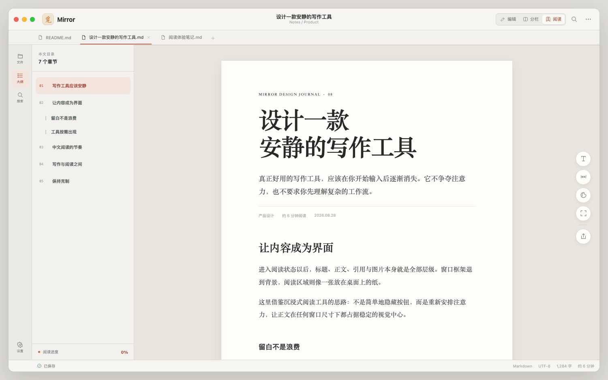

# Mirror Immersive Reader UI Demo

这是 Mirror 的独立界面方向，只用于评审，不参与应用构建，也未修改 `Sources/Mori` 下的正式界面。



## 查看方式

直接打开 `index.html`，或在本目录启动静态服务：

```bash
python3 -m http.server 4174
```

然后访问 <http://127.0.0.1:4174>。

## 设计方向

- 借鉴简悦强调的沉浸式阅读、自动目录、顶部阅读进度和按需悬浮工具，但不复制其品牌、图标或高饱和配色。
- 阅读模式默认使用居中的纸张式正文，外围界面退到暖灰背景中。
- 文件区和大纲共用左侧上下文抽屉，通过窄导航栏切换，减少同时展示四栏造成的拥挤。
- 字体、栏宽、主题、专注与导出收进右侧悬浮工具列；低频设置展开后才占用空间。
- 保留 Mirror 的标签页、文件树、文章大纲、编辑、分栏、阅读和底部状态信息。
- 所有过渡使用无回弹的贝塞尔缓动，并继续支持系统“减少动态效果”。

## 可交互内容

- 切换文件抽屉与文章大纲，重复点击可关闭抽屉
- 切换编辑、分栏和阅读模式
- 点击目录跳转章节并更新阅读进度
- 调整正文栏宽、阅读主题和字号
- 进入专注模式

## 参考

- [简悦官方网站](https://simpread.pro/)
- [简悦开源仓库](https://github.com/Kenshin/simpread)

提取的是“正文优先”的信息组织原则，不是视觉复刻。Mirror 仍使用原生 macOS 窗口结构；品牌标记采用素雅的泛黄纸底与橙色毛笔“觅”字，交互状态则使用单一低饱和珊瑚色强调。
