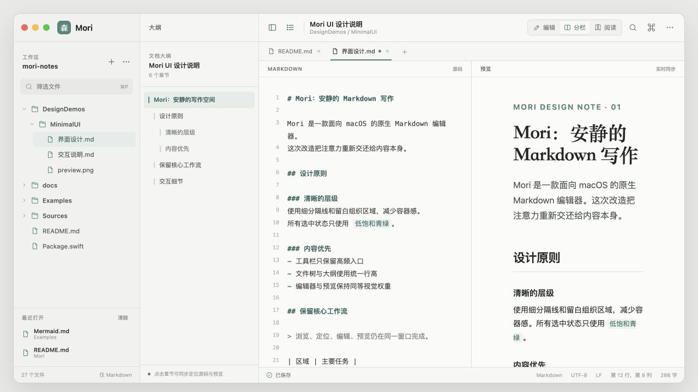
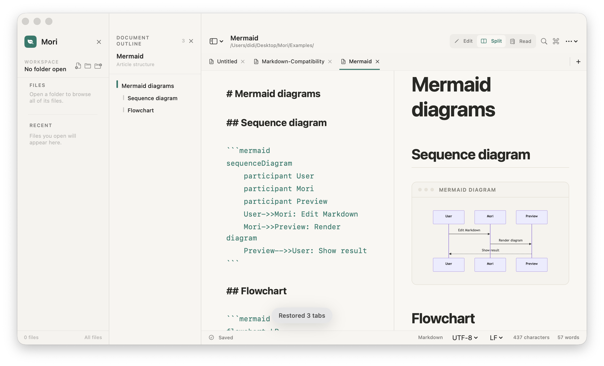
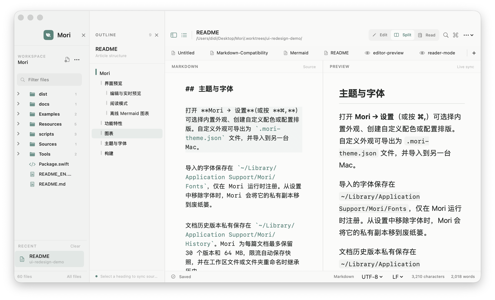

# Mirror Minimal UI Demo

这是 Mirror 简约风界面的独立原型与落地记录。原型文件不会参与应用构建；确认方向后，正式 SwiftUI 界面已分轮实现。



正式 SwiftUI 界面的首轮实现效果：



第二轮细节精修效果：



## 查看方式

直接双击 `index.html`，或在当前目录启动本地静态服务：

```bash
python3 -m http.server 4173
```

然后访问 <http://127.0.0.1:4173>。

## 已覆盖的核心区域

- 可展开的工作区文件树和最近文件
- 独立文档大纲，以及源码/预览同步章节定位
- 顶部工具栏和编辑、分栏、阅读三种模式
- 多文档标签栏
- Markdown 源码区与格式化预览区
- 保存状态、格式、编码、行列和字数状态栏

## 关键设计取舍

1. **减少视觉容器**：移除侧栏的大按钮卡片，用紧凑工具行、列表和细分隔线组织功能。
2. **重排工具优先级**：导航开关、文档身份和阅读模式放在一级工具栏；低频命令收进末尾入口。
3. **统一选中语义**：文件、章节、视图模式和活动标签只使用一套低饱和青绿色，不再叠加多种强调样式。
4. **强化内容层级**：界面采用系统无衬线字体，文档标题用克制的衬线字体；源码与预览保持相近视觉权重。
5. **保留原有工作流**：四栏布局、标签页、双向滚动、章节跳转与状态信息仍然可见且可操作。

## 第二轮精修

- 自定义内容延伸进 macOS 标题栏，让交通灯、品牌、大纲标题和主工具栏回到同一层。
- 文件栏按 Demo 收敛为“工作区工具行 + 文件筛选 + 文件树 + 固定最近文件”，移除重复的文件区标题和根目录工具行。
- 源码与预览顶部补齐 30pt 分区标题，并采用等宽源码、衬线一级标题和更轻的表格分隔样式。
- Paper 主题改为 Demo 的中性灰层级，仅保留低饱和青绿色强调色。
- 当前文件、最近文件和当前章节使用同一套低饱和选中态，并补齐鼠标悬停反馈。
- 标签关闭按钮仅在活动或悬停时出现，减少标签栏常驻噪音。
- 文档大纲会跟随编辑器/预览的滚动位置标记当前章节。
- 空目录、文件过滤无结果、空白编辑器和空白阅读模式提供轻量空状态。
- 顶部模式切换与底部状态栏在窄窗口下自动收缩，优先保留核心操作和字数。
- 启动恢复提示改为短暂浮层，不再持续遮挡正文。
- 侧栏、模式切换、标签增删、拖拽落点和空状态使用 140–320ms 的克制过渡，并自动遵循 macOS“减少动态效果”。

## 对现有界面的观察

- 当前信息架构已经完整，但左侧新建/打开卡片、文件夹按钮、分区标题和文件树同时争夺注意力。
- 顶部文档信息、主题、排版、格式、查找、阅读、预览和保存等入口密度较高，主次不够明确。
- 活动标签同时使用底线、填充和字重，侧栏又有图标色、计数胶囊和多种底色，强调语言偏多。
- 源码和预览排版本身清晰；改造重点应放在外围框架降噪，而不是改变阅读体验。
