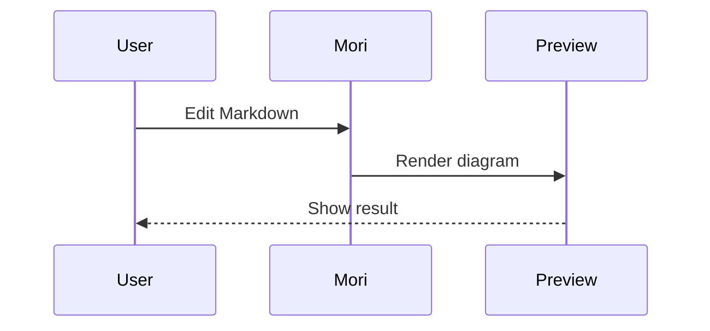
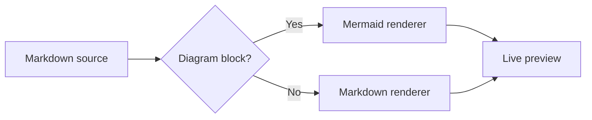

# Mermaid diagrams

## Sequence diagram

```mermaid
sequenceDiagram
    participant User
    participant Mori
    participant Preview
    User->>Mori: Edit Markdown
    Mori->>Preview: Render diagram
    Preview-->>User: Show result
```

## Flowchart

```mermaid
flowchart LR
    A[Markdown source] --> B{Diagram block?}
    B -- Yes --> C[Mermaid renderer]
    B -- No --> D[Markdown renderer]
    C --> E[Live preview]
    D --> E
```
