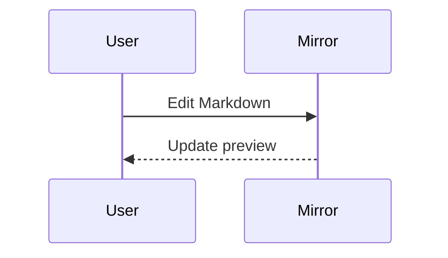

# Mirror

简体中文 | [English](README_EN.md)

Mirror 是一款原生 macOS Markdown 编辑器，以素雅、安静且专注的写作体验为核心。新版界面采用暖灰工作区、纸张式阅读画布和低饱和橙色强调色，让文件管理、写作与阅读保持清晰但不过度打扰。

## 界面预览

### 编辑与实时预览

58px 导航窄栏集中提供文件、大纲、搜索和设置入口；文件树与文档大纲共用一个可调宽抽屉。语法高亮源码编辑器与实时预览继续保持双向语义锚点同步。


### 阅读模式

阅读模式使用居中的纸张式画布，并提供阅读宽度、字体、主题、专注模式和导出工具。左侧章节导航与底部阅读进度仍会随正文位置更新。


### 离线 Mermaid 图表

Mermaid 源码可以在无网络环境下直接渲染到预览区。


## 功能特性

- 原生 Markdown 编辑器，支持轻量语法高亮
- 原生 macOS 简约界面，使用暖灰背景、纸张式内容层级和单一低饱和橙色强调色
- 编辑与实时预览分栏同样使用居中纸张画布，与沉浸阅读模式保持一致的排版层级
- 常驻导航窄栏，文件树与文档大纲使用互斥、可调宽的共享抽屉，并可分别关闭
- 沉浸式阅读画布，提供实时阅读进度和字体、行高、页面宽度、主题及导出浮动工具
- 面板与模式切换采用自然缓动，并遵循 macOS“减少动态效果”设置
- 实时渲染预览，内置 8 套明亮与深色主题
- 自定义主题编辑器，支持复制配色、JSON 导入/导出和选择持久化
- 写作、预览和代码字体可独立设置，支持调整字号、行距、行高和阅读宽度
- 私有导入 TTF、OTF 和 TTC 字体；字体仅保存在 Mirror 内，不会修改系统字体
- 可配置行号、当前行高亮、拼写检查、自动换行、打字机模式、Tab 宽度和自动保存延迟
- 可选括号/引号自动配对，Tab 与 Shift-Tab 根据设置宽度对选中内容缩进
- 支持 GitHub 风格 Markdown 表格、对齐方式和自适应溢出
- 可视化 Markdown 表格构建器，可配置行列、每列对齐方式并预览源码
- 支持安全的行内与块级 HTML 元素，包括样式化 span、details、媒体和相对路径本地图片
- Markdown 图片工作流支持文件选择、Finder 拖放和剪贴板图片；资源会复制到文档旁边并生成避免冲突的相对链接
- 常见语言代码块的离线语法高亮
- 离线 Mermaid 图表，支持时序图、流程图、类图、状态图、ER 图和甘特图
- 离线 KaTeX 数学公式，支持行内 `$…$`、块级 `$$…$$` 和 `\\[…\\]`，并生成可访问的 MathML
- 支持脚注、Setext 标题、删除线、任务列表、可变长行内代码、反引号/波浪号代码块、表格和安全 HTML 扩展
- 额外 CommonMark 兼容：转义标点、多行引用、嵌套混合/任务列表、引用式链接与图片、空格分隔线、`+` 列表标记、`)` 有序列表标记、非 1 起始序号、ATX 结尾 `#` 和尖括号链接目标
- 编辑器与预览区采用语义锚点双向同步，可选择智能 35%、顶部、居中或关闭同步
- 长文档性能优化：后台防抖渲染、文档分析缓存和超大文件可见区域语法高亮
- 纯格式化阅读模式
- 编辑模式和阅读模式均支持大纲导航
- 在渲染后的 Markdown 中点击本地链接，可在 Mirror 内以可编辑或预览标签打开
- 文档大纲与标题快速导航
- 持久化最近文件列表和 Finder 操作
- 虚拟化递归文件树，支持展开子目录和所有文件类型
- 按工作区文件名/路径过滤，并提供覆盖工作区与最近文件的 `⌘P` 快速打开面板
- 异步文件夹全文搜索，支持区分大小写和正则表达式模式（`⇧⌘F`）
- 工作区文件操作：创建、重命名、拖放、复制、剪切、粘贴和移到废纸篓
- 可选择仅显示 Markdown 文件
- 在应用内预览 PDF、Office、媒体和其他非文本二进制格式
- 支持编辑文本和源码文件，保留编码并按语言高亮
- 保留 UTF/传统编码以及 LF/CRLF/CR 换行符，状态栏可按文档控制编码与换行符
- 原生降采样图片预览和缩放控制，不使用快速查看
- 向 Finder 注册文本、源码、Markdown、图片和 PDF 文档的“打开方式”
- 独立的纵向文档大纲栏
- 文件库和大纲面板可分别关闭
- 支持打开、拖放、保存、自动保存和另存为
- 未保存草稿的防崩溃恢复快照，文件写入始终在 UI 线程之外执行
- 关闭窗口或退出应用时同步保存会话检查点，包含退出前最后时刻的编辑
- 监控外部文件变更，提供冲突安全的自动保存、重新加载、覆盖和另存为处理方案
- 单窗口文档标签，支持 Markdown、源码、文本、图片和二进制预览，包含会话恢复与防止重复打开
- 专注模式和阅读统计
- 从顶部工具栏导出便携 HTML 和可直接打印的 PDF；保留主题、排版、内嵌本地媒体、表格、代码高亮、数学公式和 Mermaid 图表
- 原生 macOS 打印流程与 A4 分页样式
- 键盘快捷键和原生 macOS 菜单
- 主要导航、编辑、预览、格式化、历史和保存控件均提供 VoiceOver 标签
- 标准快捷键：`⇧⌘F` 文件夹搜索、`⇧⌘J` 专注模式和 `⌥⌘I` 插入图片
- 原生查找/替换、跳转到行和扩展的 Markdown 格式命令面板
- 可搜索的键盘命令面板（`⇧⌘P`），覆盖文件、导航、格式化、导出、视图、主题和设置
- 每篇文档均有本地历史，支持预览和一键恢复；每篇文档最多 30 个版本、64 MB
- Markdown 列表、任务项、有序列表、引用和源码缩进的智能回车处理

## 导出

点击主窗口右上角的导出按钮，可以生成便携 HTML、PDF，或进入 macOS 打印流程。HTML 会将文档目录内的常规本地图片和媒体内嵌到单个文件中；单个资源超过 32 MB 或内嵌资源合计超过 96 MB 时会保留原始链接，并在导出完成后提示。

## 图表

使用 `mermaid` 围栏代码块，即可在实时预览中渲染图表：

````markdown

````

内置渲染器可完全离线工作。更多示例请查看 [`Examples/Mermaid.md`](Examples/Mermaid.md)。

图表渲染使用应用内置的 MIT 许可 `@mermaid-js/tiny` 运行时。

数学公式使用 MIT 许可的 KaTeX 运行时和内置 WOFF2 数学字体。它可以离线工作，并保留在 HTML、PDF 和打印输出中。详见 [`Examples/Markdown-Compatibility.md`](Examples/Markdown-Compatibility.md)。

## 主题与字体

打开 **Mirror → 设置**（或按 **⌘,**）可选择内置外观、创建自定义配色或配置排版。自定义外观可导出为 `.mori-theme.json` 文件，并导入到另一台 Mac。

导入的字体保存在 `~/Library/Application Support/Mori/Fonts`，仅在 Mirror 运行时注册。从设置中移除字体时，Mirror 会将它的私有副本移到废纸篓。

文档历史版本私有保存在 `~/Library/Application Support/Mori/History`。Mirror 为每篇文档最多保留 30 个版本和 64 MB，限流自动保存快照，并在工作区文件或文件夹重命名时继承历史。

## 构建

需要 macOS 14 或更高版本，以及 Swift 6 工具链。

```bash
chmod +x scripts/build-app.sh
./scripts/build-app.sh
open dist/Mori.app
```

开发模式：

```bash
swift run Mori
```

发布构建会生成 Universal 2（`arm64` + `x86_64`）的 `dist/Mori.app`，并应用本地临时签名。无需安装完整 Xcode。

生成可拖入“应用程序”目录安装的 DMG：

```bash
chmod +x scripts/build-dmg.sh
./scripts/build-dmg.sh
```

安装包输出到 `dist/Mori-1.0.dmg`。当前构建使用本地临时签名；公开分发时还需要 Apple Developer ID 签名和 Apple 公证。
