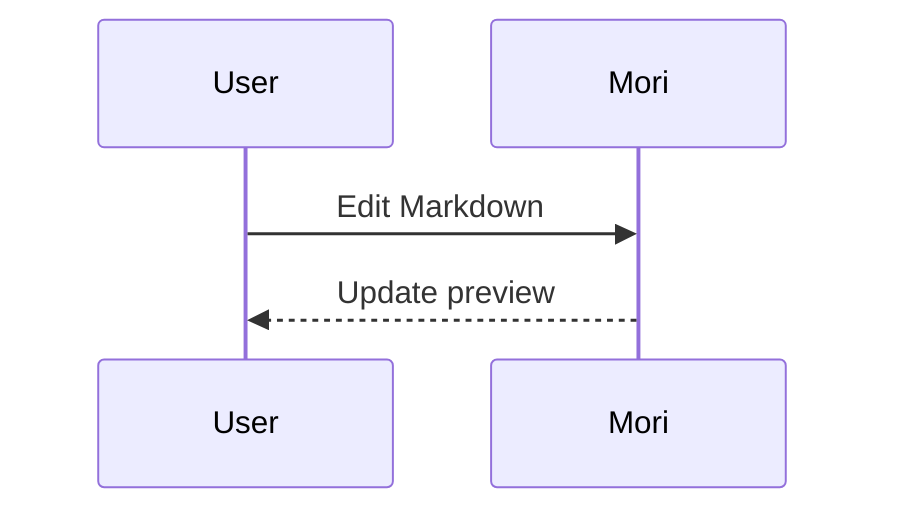

# Mori

[简体中文](README.md) | English

Mori is a native macOS Markdown editor built for a calm, focused writing experience.

## Screenshots

### Writing and live preview

Workspace files and the document outline stay alongside the syntax-highlighted source editor and synchronized live preview.


### Reader mode

Reader mode gives the rendered document more space while keeping workspace and heading navigation available.


### Offline Mermaid diagrams

Mermaid source renders directly in the preview without a network connection.


## Features

- Native Markdown editor with lightweight syntax highlighting
- Live rendered preview with eight built-in light and dark themes
- Custom theme editor with palette duplication, JSON import/export, and persistent selection
- Independent writing, preview, and code font choices with adjustable size, line spacing, line height, and reading width
- Private TTF, OTF, and TTC font import; imported fonts stay inside Mori and do not modify system fonts
- Configurable line numbers, current-line highlight, spelling, line wrapping, typewriter mode, tab width, and autosave delay
- Optional bracket/quote auto-pairing plus selection-aware Tab and Shift-Tab indentation using the configured tab width
- GitHub-style Markdown tables with alignment and responsive overflow
- Visual Markdown table builder with configurable rows, columns, per-column alignment, and source preview
- Safe inline and block HTML elements, including styled spans, details, media, and relative local images
- Markdown image workflow for file selection, Finder drag-and-drop, and clipboard images; assets are copied beside the document with collision-safe relative links
- Offline syntax highlighting for fenced code blocks across common languages
- Offline Mermaid diagrams for sequence, flowchart, class, state, ER, and Gantt syntax
- Offline KaTeX mathematics with accessible MathML for inline `$…$`, display `$$…$$`, and `\\[…\\]` forms
- Footnotes, Setext headings, strikethrough, task lists, variable-length inline code spans, backtick/tilde code fences, tables, and safe HTML extensions
- Additional CommonMark-compatible cases including escaped punctuation, multi-line blockquotes, nested mixed/task lists, reference-style links and images, spaced thematic breaks, `+` list markers, `)` ordered markers, non-1 ordered starts, closing ATX hashes, and angle-bracket link destinations
- Bidirectional semantic-anchor synchronization between editor and preview, with Smart 35%, Top, Center, and Off modes
- Long-document performance path with debounced background rendering, cached document analysis, and visible-range syntax highlighting for very large files
- Reader mode for a clean, formatted-only view
- Outline navigation in both editing and reader modes
- Local links clicked in rendered Markdown open as editable or preview tabs inside Mori
- Document outline and heading navigation
- Persistent recent-files directory with Finder actions
- Virtualized, recursive folder tree with expandable subdirectories and support for all file types
- Workspace filename/path filtering and a `⌘P` Quick Open palette across workspace and recent files
- Asynchronous folder-wide full-text search with case-sensitive and regular-expression modes (`⇧⌘F`)
- Workspace file operations for creating, renaming, dragging, copying, cutting, pasting, and moving items to Trash
- Optional Markdown-only folder filter
- In-app system previews for PDF, Office, media, and other non-text binary formats
- Editable text and source files with encoding preservation and language-aware syntax highlighting
- Preserved UTF/legacy encodings and LF/CRLF/CR line endings, with per-document encoding and line-ending controls in the status bar
- Native, downsampled image previews with zoom controls (without Quick Look)
- Finder/Open With registration for text, source, Markdown, image, and PDF documents
- Dedicated vertical document-outline column
- Independently closable file-library and outline panels
- Open, drag-and-drop, save, autosave, and Save As
- Crash-safe recovery snapshots for unsaved drafts, with file writing kept off the UI thread
- Synchronous session checkpoint on window close and application termination, covering edits made immediately before quitting
- External-file change monitoring with conflict-safe autosave, reload, overwrite, and Save As recovery choices
- Single-window document tabs for Markdown, source, text, images, and binary previews, including restored tab sessions and duplicate-open prevention
- Focus mode and reading statistics
- HTML and print-ready PDF export with theme, typography, local media, tables, code highlighting, and Mermaid diagrams preserved
- Native macOS print workflow with A4-aware pagination styles
- Keyboard shortcuts and native macOS menus
- VoiceOver labels for primary navigation, editing, preview, formatting, history, and save controls
- Standard `⇧⌘F` folder search, `⇧⌘J` focus mode, and `⌥⌘I` image insertion shortcuts
- Native Find/Replace, Go to Line, and an expanded Markdown formatting command palette
- Searchable keyboard command palette (`⇧⌘P`) spanning files, navigation, formatting, export, views, themes, and settings
- Per-document local history with preview and one-click restore; each document is capped at 30 versions and 64 MB
- Smart Return handling for Markdown lists, task items, ordered lists, quotes, and source-code indentation

## Diagrams

Use a `mermaid` fenced code block to render diagrams in the live preview:

````markdown

````

The bundled renderer works offline. See [`Examples/Mermaid.md`](Examples/Mermaid.md) for more examples.

Diagram rendering uses the MIT-licensed `@mermaid-js/tiny` runtime bundled with the application.

Mathematics rendering uses the MIT-licensed KaTeX runtime and bundled WOFF2 math fonts. It works without a network connection and is preserved in HTML, PDF, and print output. See [`Examples/Markdown-Compatibility.md`](Examples/Markdown-Compatibility.md).

## Themes and fonts

Open **Mori → Settings** (or press **⌘,**) to choose an included skin, create a custom palette, or configure typography. A custom skin can be exported as a `.mori-theme.json` file and imported on another Mac.

Imported font files are stored in `~/Library/Application Support/Mori/Fonts` and registered only while Mori is running. Removing an imported font from Settings moves Mori's private copy to Trash.

Saved document versions are stored privately in `~/Library/Application Support/Mori/History`. Mori keeps at most 30 versions and 64 MB per document, throttles autosave snapshots, and carries history forward when workspace files or folders are renamed.

## Build

Requires macOS 14 or newer and the Swift 6 toolchain.

```bash
chmod +x scripts/build-app.sh
./scripts/build-app.sh
open dist/Mori.app
```

For development:

```bash
swift run Mori
```

The release build creates a Universal 2 (`arm64` + `x86_64`) `dist/Mori.app` and applies an ad-hoc local signature. No full Xcode installation is required.
