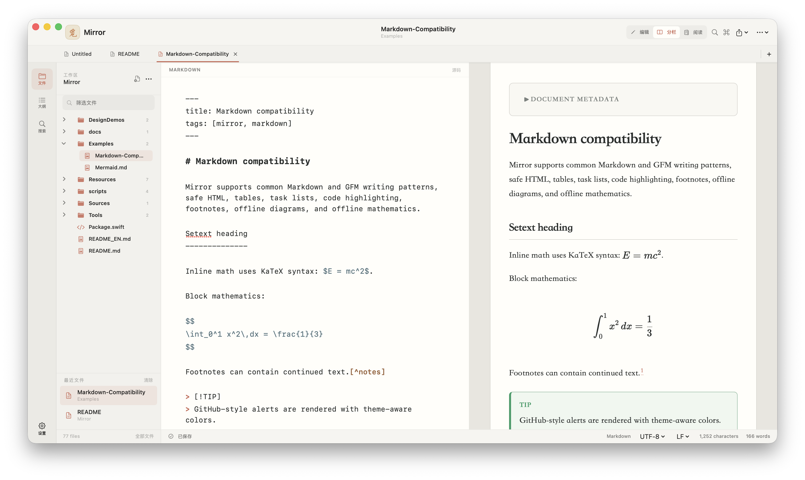
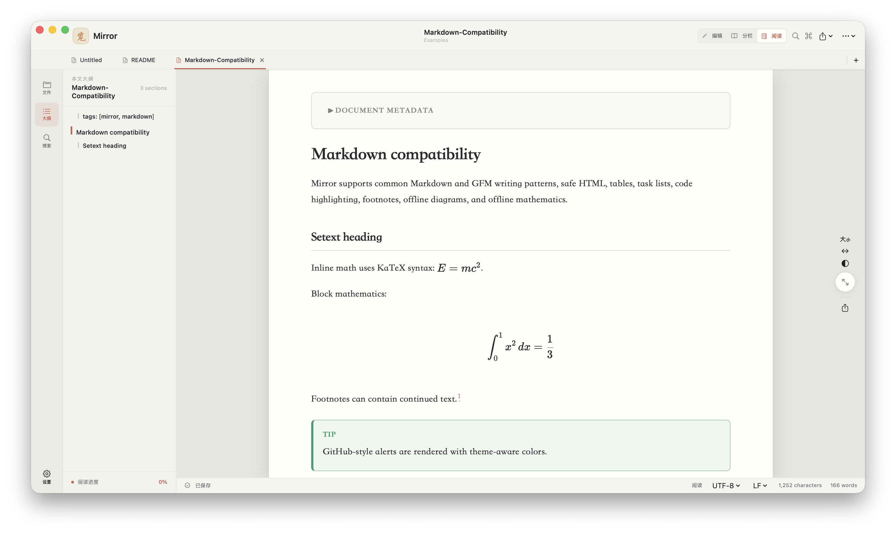
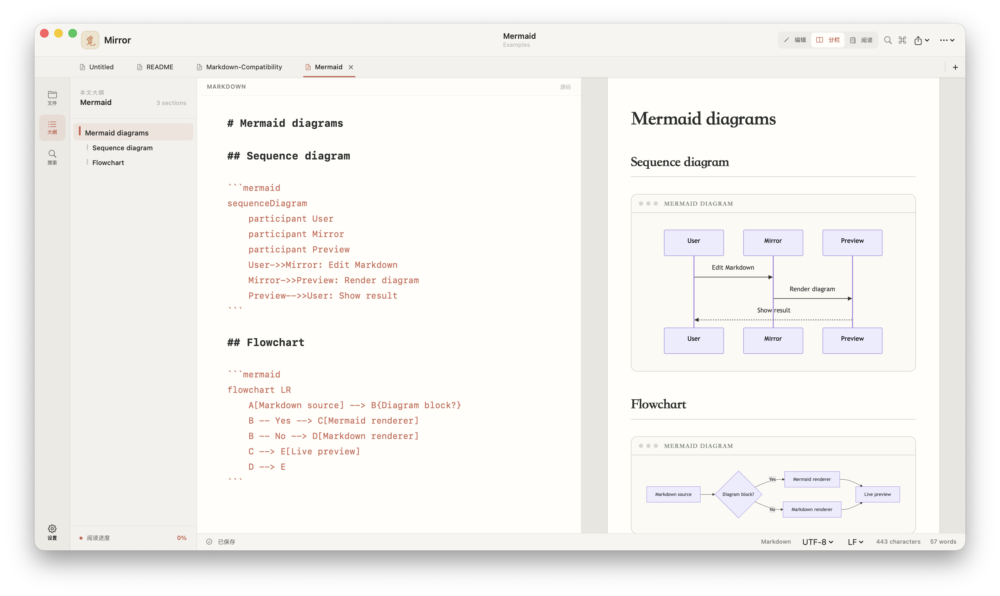

# Mirror

[简体中文](README.md) | English

Mirror is a native macOS Markdown editor designed for a calm, clear writing experience. It brings file management, source editing, live preview, and immersive reading into one lightweight workspace, using warm neutrals, a paper-like content surface, and one muted orange accent.

[Download Mirror 1.0](https://github.com/BoneInk/Mirror/releases/latest) · Requires macOS 14 or newer

## Screenshots

### Writing and live preview

The file tree and document outline are easy to switch between, while Markdown source and formatted preview stay synchronized through semantic anchors.



### Reader mode

Reader mode removes source-level noise and provides a full-height paper canvas, heading navigation, reading progress, and lightweight typography controls.



### Mermaid diagrams

Mermaid diagrams render locally and offline, so source and results can be viewed side by side while editing.



## Core features

- Native Markdown editing with syntax highlighting, live preview, and bidirectional scroll sync
- Workspace file tree, recent files, tabs, folder search, and document outline
- Immersive reader mode with adjustable width, typography, line height, and themes
- Built-in rendering for tables, highlighted code, images, HTML, Mermaid, and KaTeX
- Simplified Chinese by default, optional English, plus light, dark, and custom themes
- Autosave, crash recovery, external-change detection, and local document history
- Portable HTML and PDF export with the native macOS print workflow

Mirror supports commonly used CommonMark and GitHub-style Markdown, including task lists, footnotes, tables, reference links, fenced code, and safe HTML. Text and source files open as editable documents, while images, PDFs, and common binary formats can be previewed inside the app.

## Build

Requires macOS 14 or newer and the Swift 6 toolchain.

```bash
swift build
swift run Mirror
```

Build the Universal 2 app and an installable DMG:

```bash
./scripts/build-app.sh release
./scripts/build-dmg.sh --skip-build
```

Outputs are written to `dist/Mirror.app` and `dist/Mirror-1.0.dmg`. Local builds use an ad-hoc signature; public distribution still requires Apple Developer ID signing and Apple notarization.
